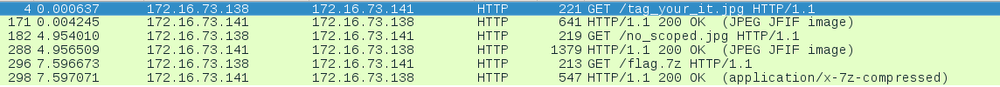

<h2>Challenge</h2>
<b>You are surrounded by zombies on all sides. Blood and flesh that drip from their mouths. You run for cover in an abandoned building. As you huddle in terror under a delapitated desk your foot brushes against a small package. What could be inside???</b>

Download file: [Tag.gz](tag.gz)


<h2>Process</h2>

<b>Step 1.</b>
Check what type the file actually is. 

```bash
file tag.gz 
tag.gz: pcap-ng capture file - version 1.0
```


Gotcha, not a gz, to Wireshark. 

<b>Step 2.</b>
After quickling scanning through, it's mostly HTTP traffic, I see 2 images files and a flag.7z. Using File > Export Objects > HTTP to extract the files.



Files Extracted:
* flag.7z
* tag_your_it.jpg
* no_scoped.jpg

<b>Step 3.</b>
Check each file type using `file` again. Each file is infact its correct file type. Lets try extracting that 7Zip. `7z d flag.gz`  and I am met with a password prompt. Tried a few easy guesses like a blank password, password, file name, challenge name. The password must be somewhere since this is forensics. I set up a bruteforcer to run in the background and continued on looking for the next piece of the puzzle. 

<b>Step 4.</b>
I went on the hunt, opened each of the images looking for clues.  One was a image of a astronaut on the moon looking as an object (Asteroid?) went throught the Earth, destroying it. The other, after some Google searching and Google image searching is the Fallout New Vegas Video game. The challenge mentioned a saloon, and in the image is the Prospectors Saloon.  I ended up wasting a bit of time searching into this without much luck.

I used `strings` on the flag.7z and the two images. flag.7z contained flag.txt, which was also mentioned when the wrong password was used to attempt to extract it. Nothing of real interest in the images. I checked the exif data anyways, nothing stuck out.


I decided to use `strings` on the tag.gz pcap. 

```bash
strings tag.gz

......<removed>......
mNDg2NTIwNzc2MTZjNmI2NTY0MjA2Zjc1NzQyMDY5NmUyMDc0Njg2NTIwNjc3MjYxNzkyMDZjNjk2NzY4NzQyMDYxNmU2NDIwNzM3NDZmNmY2NDIwNjE2ZTY0MjA2ODY1MjA3MzYxNzcyMDY2NmY3MjIwNjEyMDYyNzI2OTY1NjYyMDZkNmY2ZDY1NmU3NDIwNzQ2ODY1MjA2MTYyNzM2ZjZjNzU3NDY1MjA3NDcyNzU3NDY4MjA2ZjY2MjA3NDY4NjUyMDc3NmY3MjZjNjQyZTIwNTQ2ODY1MjA2MzZmNmM2NDIwNzI2NTZjNjU2ZTc0NmM2NTczNzMyMDYzNjk3MjYzNmM2OTZlNjcyMDZmNjYyMDc0Njg2NTIwNjk2ZTc0NjU3Mzc0NjE3NDY1MjA2NTYxNzI3NDY4MmUyMDQ0NjE3MjZiNmU2NTczNzMyMDY5NmQ3MDZjNjE2MzYxNjI2YzY1MmUyMDU0Njg2NTIwNjI2YzY5NmU2NDIwNjQ2ZjY3NzMyMDZmNjYyMDc0Njg2NTIwNzM3NTZlMjA2OTZlMjA3NDY4NjU2OTcyMjA3Mjc1NmU2ZTY5NmU2NzJlMjA1NDY4NjUyMDYzNzI3NTczNjg2OTZlNjcyMDYyNmM2MTYzNmIyMDc2NjE2Mzc1NzU2ZDIwNmY2NjIwNzQ2ODY1MjA3NTZlNjk3NjY1NzI3MzY1MmUyMDQxNmU2NDIwNzM2ZjZkNjU3NzY4NjU3MjY1MjA3NDc3NmYyMDY4NzU2ZTc0NjU2NDIwNjE2ZTY5NmQ2MTZjNzMyMDc0NzI2NTZkNjI2YzY5NmU2NzIwNmM2OTZiNjUyMDY3NzI2Zjc1NmU2NDJkNjY2Zjc4NjU3MzIwNjk2ZTIwNzQ2ODY1Njk3MjIwNjM2Zjc2NjU3MjJlMjA0MjZmNzI3MjZmNzc2NTY0MjA3NDY5NmQ2NTIwNjE2ZTY0MjA2MjZmNzI3MjZmNzc2NTY0MjA3NzZmNzI2YzY0MjA2MTZlNjQyMDYyNmY3MjcyNmY3NzY1NjQyMDY1Nzk2NTczMjA3NzY5NzQ2ODIwNzc2ODY5NjM2ODIwNzQ2ZjIwNzM2ZjcyNzI2Zjc3MjA2OTc0MmU=
```

The last output of strings was the above block of characters. This looks like base64.  I put it into a file and `base64 -d file`, no luck. Didnt work. I decided to find this data in Wireshark. It was in Packet 313, which interestingly was TCP with flags PSH and ACK set. When viewing the data in the packet everything after the starting `m` of my potential base64 string was highlighted. Loooking at the packet at more detail, the `m` was part of the `SEQ/ACK Analysis` and NOT the Data portion of the packet. I remove the `m` it decoded successfully.


<b>Step 5.</b>
The decoded base64 was the following:
```bash
48652077616c6b6564206f757420696e207468652067726179206c6967687420616e642073746f6f6420616e642068652073617720666f722061206272696566206d6f6d656e7420746865206162736f6c757465207472757468206f662074686520776f726c642e2054686520636f6c642072656c656e746c65737320636972636c696e67206f662074686520696e746573746174652065617274682e204461726b6e65737320696d706c616361626c652e2054686520626c696e6420646f6773206f66207468652073756e20696e2074686569722072756e6e696e672e20546865206372757368696e6720626c61636b2076616375756d206f662074686520756e6976657273652e20416e6420736f6d6577686572652074776f2068756e74656420616e696d616c73207472656d626c696e67206c696b652067726f756e642d666f78657320696e20746865697220636f7665722e20426f72726f7765642074696d6520616e6420626f72726f77656420776f726c6420616e6420626f72726f7765642065796573207769746820776869636820746f20736f72726f772069742e
```

I quickly noticed the prescene of `20` throughout the file, and that it was all hex valid characters.  I decided this could be ASCII and put added in %'s to the start of every 2 characters to decode it.

I came up with the following:

```
cat b64_stuff | sed 's/../&%/g;s/+$//' > url_encoded
```
Then I just had to add a % to the very first 2 characters and remove the trailing %.

```bash
%48%65%20%77%61%6c%6b%65%64%20%6f%75%74%20%69%6e%20%74%68%65%20%67%72%61%79%20%6c%69%67%68%74%20%61%6e%64%20%73%74%6f%6f%64%20%61%6e%64%20%68%65%20%73%61%77%20%66%6f%72%20%61%20%62%72%69%65%66%20%6d%6f%6d%65%6e%74%20%74%68%65%20%61%62%73%6f%6c%75%74%65%20%74%72%75%74%68%20%6f%66%20%74%68%65%20%77%6f%72%6c%64%2e%20%54%68%65%20%63%6f%6c%64%20%72%65%6c%65%6e%74%6c%65%73%73%20%63%69%72%63%6c%69%6e%67%20%6f%66%20%74%68%65%20%69%6e%74%65%73%74%61%74%65%20%65%61%72%74%68%2e%20%44%61%72%6b%6e%65%73%73%20%69%6d%70%6c%61%63%61%62%6c%65%2e%20%54%68%65%20%62%6c%69%6e%64%20%64%6f%67%73%20%6f%66%20%74%68%65%20%73%75%6e%20%69%6e%20%74%68%65%69%72%20%72%75%6e%6e%69%6e%67%2e%20%54%68%65%20%63%72%75%73%68%69%6e%67%20%62%6c%61%63%6b%20%76%61%63%75%75%6d%20%6f%66%20%74%68%65%20%75%6e%69%76%65%72%73%65%2e%20%41%6e%64%20%73%6f%6d%65%77%68%65%72%65%20%74%77%6f%20%68%75%6e%74%65%64%20%61%6e%69%6d%61%6c%73%20%74%72%65%6d%62%6c%69%6e%67%20%6c%69%6b%65%20%67%72%6f%75%6e%64%2d%66%6f%78%65%73%20%69%6e%20%74%68%65%69%72%20%63%6f%76%65%72%2e%20%42%6f%72%72%6f%77%65%64%20%74%69%6d%65%20%61%6e%64%20%62%6f%72%72%6f%77%65%64%20%77%6f%72%6c%64%20%61%6e%64%20%62%6f%72%72%6f%77%65%64%20%65%79%65%73%20%77%69%74%68%20%77%68%69%63%68%20%74%6f%20%73%6f%72%72%6f%77%20%69%74%2e
```

<b>Step 6.</b>

I then URL Decoded to get:

"*He walked out in the gray light and stood and he saw for a brief moment the absolute truth of the world. The cold relentless circling of the intestate earth. Darkness implacable. The blind dogs of the sun in their running. The crushing black vacuum of the universe. And somewhere two hunted animals trembling like ground-foxes in their cover. Borrowed time and borrowed world and borrowed eyes with which to sorrow it.*"

I pasted this into Google and got some quotes from the book "The Road".

`7z d flag.7z`
password:`the road`

Success! 
`sun{phUn_1n_7h3_c0MPl373_l4ck_0f_5UN}`


